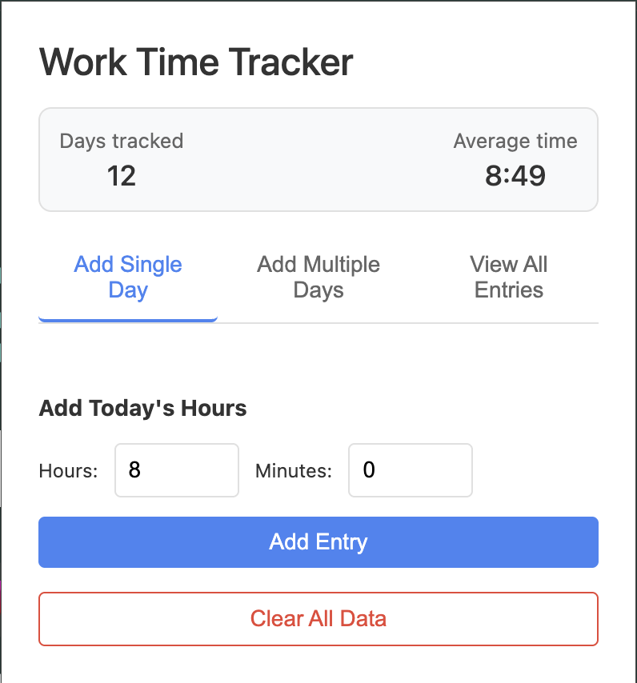

# Work Time Tracker Chrome Extension ⏱️

A simple and elegant Chrome extension to track your daily working hours and calculate your average work time. Perfect for freelancers, remote workers, and anyone who wants to keep track of their working hours.

## ✨ Features

- 📊 Track daily working hours with precision
- 📅 Add multiple days at once for bulk entries
- 📋 View all time entries in a clean, organized list
- 📈 Calculate and display average working hours
- 🎨 Clean and minimalist UI design
- 💾 Data persistence using Chrome storage
- 🔔 Modern notification system
- 🎯 Easy to use interface

## 🖼️ Screenshots



## 🚀 Installation

### Method 1: Install from Source Code
1. Clone this repository or download the source code
2. Open Chrome and go to `chrome://extensions/`
3. Enable "Developer mode" in the top right corner
4. Click "Load unpacked" and select the extension directory
5. The extension is now installed! 🎉

### Method 2: Install from Chrome Web Store (Coming Soon)
- Stay tuned for the Chrome Web Store release
- This will provide the easiest installation method

## 📖 Usage Guide

### Quick Start
1. Click the extension icon in your Chrome toolbar to open the popup
2. Choose from three convenient tabs:
   - **Add Single Day**: Quick entry for today's hours
   - **Add Multiple Days**: Bulk entry for multiple days
   - **View All Entries**: Complete history of your time entries

### Detailed Instructions

#### Adding a Single Day Entry
1. Click "Add Single Day" tab
2. Enter hours and minutes
3. Click "Add Entry"
4. You'll see a smooth notification confirming your entry

#### Adding Multiple Days
1. Click "Add Multiple Days" tab
2. Enter the number of days
3. Enter hours and minutes
4. Click "Add Multiple Entries"
5. All entries will be added automatically

#### Viewing and Managing Entries
1. Click "View All Entries" tab
2. Browse your complete time entry history
3. Each entry shows:
   - Date
   - Time worked
   - Quick delete option
4. Entries are sorted by date (newest first)

#### Data Management
- Use "Clear All Data" to reset your entries
- ⚠️ Warning: This action cannot be undone

## 🛠️ Development

### Project Structure
```
work-time-tracker/
├── manifest.json      # Extension configuration
├── popup.html        # Main extension popup
├── popup.js         # Popup functionality
└── icons/           # Extension icons
    ├── icon16.png
    ├── icon48.png
    └── icon128.png
```

### Building from Source
1. Clone the repository
2. Make your changes
3. Load the extension in Chrome using Developer mode
4. Test your changes

## 🤝 Contributing

We welcome contributions! Here's how you can help:

1. Fork the repository
2. Create your feature branch (`git checkout -b feature/AmazingFeature`)
3. Commit your changes (`git commit -m 'Add some AmazingFeature'`)
4. Push to the branch (`git push origin feature/AmazingFeature`)
5. Open a Pull Request

## 📄 License

This project is licensed under the MIT License - see the LICENSE file for details.

## 🙏 Acknowledgments

- Icons provided by [icon source]
- Built with vanilla JavaScript and Chrome Extension APIs
- Inspired by the need for simple time tracking

## 📞 Support

If you encounter any issues or have suggestions:
1. Check the [Issues](https://github.com/yourusername/work-time-tracker/issues) page
2. Create a new issue if needed
3. We'll get back to you as soon as possible

---

Made with ❤️ for the developer community
